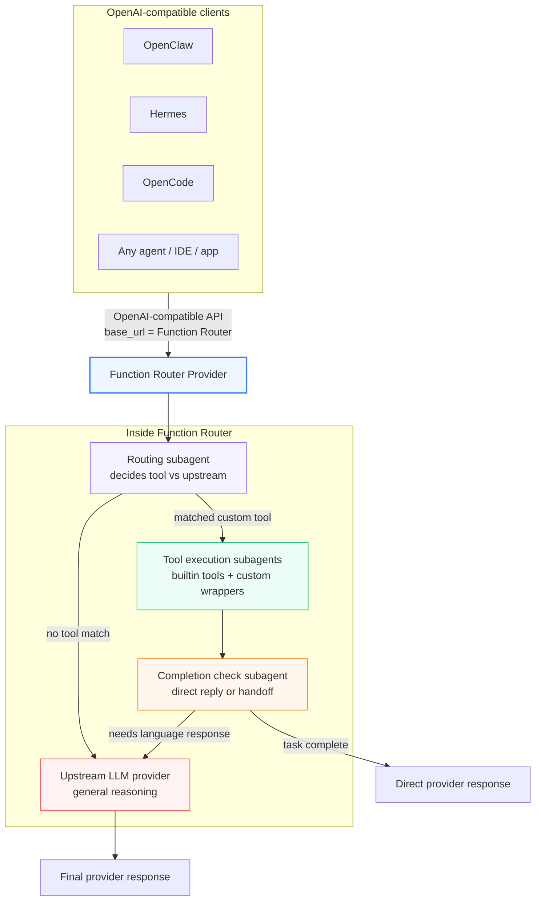

# OpenClaw Function Router

[简体中文](README.md) | English

## Demo

https://github.com/user-attachments/assets/2ee2a195-fa7f-4be1-a14c-ecdc53bbc83a

> An OpenAI-compatible Function Router Provider for vertical-domain acceleration with custom tools, while preserving the general capability of your upstream LLM.

OpenClaw Function Router is an OpenAI-compatible **model provider / provider proxy**. Any client, agent framework, gateway, IDE, or evaluation system that can call an OpenAI-compatible `base_url` can use this repository as a drop-in provider endpoint.



## Why Function Router?

| Strength | What it means |
|---|---|
| Custom tools | Wrap system control, file processing, business APIs, internal workflows, or other vertical domains as tools. |
| Vertical-domain acceleration | Matched tool requests take the Function Router fast path; all other requests transparently go to the upstream LLM. |
| Speed | On the system-control benchmark, permissive mode delivers a **6.85x speedup**. |
| Accuracy | Strict mode preserves **100.0% Pass@1** while still delivering a **4.99x speedup**. |
| Pluggable architecture | Builtin tools, wrapper scripts, the routing model, completion check, and upstream LLM can all be replaced or combined independently. |
| OpenAI-compatible | Clients only need to configure `base_url`; no calling-pattern rewrite required. |

The benchmark in this repository is a **system-control vertical** example. It shows the latency and success-rate gains after adding tools for a high-frequency domain; you can use the same pattern to accelerate your own vertical domain.

## How it works

Behind one provider interface, Function Router composes multiple specialized subagents: a local routing model decides whether to call tools, builtin or user-defined tool executors perform actions, an optional completion-check step decides whether the tool flow can answer directly, and an upstream LLM provider generates the final response when needed.

## Benchmark Results

On [50 OpenClaw desktop-control tasks](docs/benchmarks/openclaw-function-router-0308/tasks.csv), repeated 4 times each, Function Router provides two operating points: permissive mode maximizes latency reduction with **6.85x speedup**, while strict mode preserves **100.0% Pass@1** and still delivers **4.99x speedup**.

This benchmark focuses on the system-control domain. We added Function Router tools for common desktop/system actions, then measured latency and task success on that accelerated domain. We also evaluated broader general-intelligence benchmarks and observed no regression there; Function Router only intercepts requests that match your configured tools and forwards the rest to the upstream model provider.

| Mode | Models | Pass@1 | Avg latency | Speedup | Highlight | Raw results |
|---|---|---:|---:|---:|---|---|
| OpenClaw + Doubao | `doubao-seed-2-0-pro-260215` | 99.0% | 37.97s | 1.00x | Baseline | [EXP1](docs/benchmarks/openclaw-function-router-0308/exp1-openclaw-doubao/) |
| + Function Router permissive | Upstream: `doubao-seed-2-0-pro-260215`<br/>Routing: `qwen3-30b-a3b-instruct-2507` (w/o thinking) | 95.5% | 5.54s | **6.85x** | Fastest mode | [EXP2](docs/benchmarks/openclaw-function-router-0308/exp2-openclaw-doubao-fr-permissive/) |
| + Function Router strict | Upstream: `doubao-seed-2-0-pro-260215`<br/>Routing: `qwen3-30b-a3b-instruct-2507` (w/o thinking) | **100.0%** | 7.61s | **4.99x** | Best reliability-speed balance | [EXP3](docs/benchmarks/openclaw-function-router-0308/exp3-openclaw-doubao-fr-strict/) |

Benchmark task set and aggregate reports are available in [`docs/benchmarks/openclaw-function-router-0308/`](docs/benchmarks/openclaw-function-router-0308/).

(TODO) 开源可视化自动评测平台

## Quick Start

1. Clone this repository.
2. Install the package:

```bash
pip install .
```

3. Run the installer:

```bash
./scripts/install.sh
```

The installer will ask you to configure two LLM endpoints:

| Setting | What it is | Example |
|---------|-----------|---------|
| **Routing model base URL** | Any OpenAI-compatible endpoint whose model supports tool calling. FR sends only the user's latest message here to decide if a tool should be invoked. | `https://api.example.com/v1` |
| **Routing model name** | The model name at that endpoint. It can be Qwen, GPT, or any other OpenAI-compatible tool-calling model. | `your-tool-calling-model` |
| **Routing model API key** | API key for the routing endpoint. Use `any` if it does not require auth, or `${ROUTING_API_KEY}` for environment substitution. | `${ROUTING_API_KEY}` |
| **Upstream base URL** | The main LLM API endpoint. When no tool matches (or after tool execution), the original request is forwarded here for a final response. | `https://api.openai.com/v1` |
| **Upstream API key** | API key for the upstream endpoint. | `sk-...` |
| **Upstream model name** | The model name for final responses. | `gpt-4o` |
| **Tools base directory** | The root path exposed to wrapper scripts as `FR_TOOLS_BASE_DIR`. If a script contains `TOOL_PATH="${FR_TOOLS_BASE_DIR}/wallpaper-control/scripts/wallpaper-control.py"`, then this should be the directory that contains `wallpaper-control/`. | `/home/mt/tools` |
| **OpenClaw config path** | Path to the `openclaw.json` file that should be updated to register `function_router` and the session-bridge plugin. | `~/.openclaw/openclaw.json` |

The installer also copies example tool scripts, installs the session-bridge plugin for OpenClaw, and registers `function_router` as a provider in `openclaw.json`.

The copied scripts are examples for the system-control benchmark domain, not required tools for every deployment. Builtin tools such as `find`, `ls`, `cat`, `grep`, and `sleep` are available immediately. For your own acceleration domain, use the examples as templates: define your functions in `functions.jsonl`, add wrapper scripts under `scripts/`, and point them at your real tools via `FR_TOOLS_BASE_DIR`.

4. Restart the router:

```bash
./scripts/restart.sh
```

5. Restart the full stack (FR + OpenClaw Gateway):

```bash
./restart_all.sh
```

This stops all services in reverse dependency order, then starts them back with health checks. See [Full Stack Restart](#full-stack-restart) for details.

You can add or update tools at any time after installation. Edit `~/.function-router/functions.jsonl` and add the matching `~/.function-router/scripts/<tool_name>.sh` wrapper, then restart Function Router with `./scripts/restart.sh` for the new tool definitions to take effect.

## Add your own vertical tools

Function Router is designed around custom tools: wrap the vertical domain you want to accelerate or execute deterministically, then let matched requests take the fast path. After installation, you can update `~/.function-router/functions.jsonl`, add the matching wrapper script, and restart Function Router for the new tool definitions to take effect.

### Wrapper scripts can be simple

A wrapper is just the executable entrypoint that Function Router calls for a local capability: it reads JSON arguments from `stdin`, writes JSON to `stdout`, and uses the exit code for success or failure. It can be a few lines of shell, or it can call `curl`, `systemctl`, a Go/Rust/Node binary, a Python script, or an internal company CLI. **You do not need to add an extra Python layer just to integrate with Function Router.**

Minimal contract:

- Function name must match script name: `my_tool` → `~/.function-router/scripts/my_tool.sh`
- Input: JSON on `stdin`
- Output: JSON on `stdout`
- Success: exit code `0`
- Failure: non-zero exit code, preferably with a JSON error body
- `FR_TOOLS_BASE_DIR` is optional: use it only when the wrapper needs to locate external tool files

### Example 1: weather lookup (public API, a few shell lines)

Useful for common requests like "what is the weather today" or "will it rain tomorrow". Turning weather lookup into a tool avoids webpage search and calls an authoritative API directly, making the response faster and more stable.

`functions.jsonl`:

```jsonl
{"name":"weather_lookup","description":"Query current weather for a city from a weather API.","parameters":{"type":"object","properties":{"city":{"type":"string","description":"City name, for example Beijing or Shanghai"}},"required":["city"]}}
```

`~/.function-router/scripts/weather_lookup.sh`:

```bash
#!/bin/bash
set -euo pipefail
INPUT=$(cat)
CITY=$(jq -r '.city // empty' <<<"$INPUT")
[ -z "$CITY" ] && echo '{"error":"missing city"}' && exit 1
curl -fsS "https://wttr.in/${CITY}?format=j1" | jq '{result:"ok", city:.nearest_area[0].areaName[0].value, current:.current_condition[0]}'
```

### Example 2: shipment / order status (internal API, more accurate)

Useful for requests like "where is my order", "check this shipment", or "what is the ticket status". In real deployments, replace the URL with your order, logistics, CRM, or ticketing API.

`functions.jsonl`:

```jsonl
{"name":"shipment_status","description":"Query shipment or order delivery status from an internal API.","parameters":{"type":"object","properties":{"tracking_id":{"type":"string","description":"Tracking number or order id"}},"required":["tracking_id"]}}
```

`~/.function-router/scripts/shipment_status.sh`:

```bash
#!/bin/bash
set -euo pipefail
INPUT=$(cat)
TRACKING_ID=$(jq -r '.tracking_id // empty' <<<"$INPUT")
[ -z "$TRACKING_ID" ] && echo '{"error":"missing tracking_id"}' && exit 1
curl -fsS "http://127.0.0.1:8080/shipments/${TRACKING_ID}" | jq '{result:"ok", shipment:.}'
```

### Example 3: service status (local operations tool, must be fast)

Useful for operations requests like "is the API service alive", "restart the worker", or "check the database pool". The wrapper only adapts JSON arguments; the real work can stay in `systemctl` or your internal operations CLI.

`functions.jsonl`:

```jsonl
{"name":"service_status","description":"Check local service status quickly.","parameters":{"type":"object","properties":{"service":{"type":"string","description":"System service name"}},"required":["service"]}}
```

`~/.function-router/scripts/service_status.sh`:

```bash
#!/bin/bash
set -euo pipefail
INPUT=$(cat)
SERVICE=$(jq -r '.service // empty' <<<"$INPUT")
[ -z "$SERVICE" ] && echo '{"error":"missing service"}' && exit 1
STATUS=$(systemctl is-active "$SERVICE" 2>/dev/null || true)
jq -n --arg service "$SERVICE" --arg status "$STATUS" '{result:"ok", service:$service, status:$status}'
```

### When do you need Python?

Use Python only when your vertical logic is already Python-based, or when the tool needs complex parsing or multi-step orchestration, such as image understanding, complex file formats, or batch data conversion. Even then, the wrapper should stay thin: read JSON, call the real tool, output JSON.

### Builtin Shell Tools

Function Router ships five builtin shell-style tools from internal Python code, so they are available even when there is no matching file in `scripts_dir`:

- `find`: search a path for files or directories, for example `*.mp4`
- `ls`: list directory contents
- `cat`: read a text file
- `grep`: search text in a file or directory
- `sleep`: wait for a short period

The builtin schemas live in the package file `function_router/function-builtin.jsonl`. Startup loads both:

- your configured user file from `functions_file`
- the packaged builtin file `function-builtin.jsonl`

These builtins are merged into the loaded tool list automatically. If `functions.jsonl` defines the same tool name, the user-defined entry wins and the builtin entry is skipped.

Use builtin tools when you want generic filesystem inspection without maintaining a wrapper script. Keep using `functions.jsonl` + `scripts/*.sh` for domain-specific actions such as VLC control, wallpaper changes, or device operations.

### Enable the new tool

```bash
chmod +x ~/.function-router/scripts/my_tool.sh
./scripts/restart.sh
curl -s http://127.0.0.1:18790/health | jq .
```

`tools_loaded` should increase. For a detailed walkthrough with testing steps and a deployment checklist, see [docs/adding-tools.md](docs/adding-tools.md).

## OpenClaw Integration Notes

OpenClaw-side tool delegation is enabled by default: Function Router returns `assistant.tool_calls`, the `fr-tools` plugin executes them through Function Router, and OpenClaw stores the real tool history. See [OpenClaw tool delegation](docs/openclaw-tool-delegation.md).

Function Router works as a normal OpenAI-compatible provider even without patching OpenClaw, but there is one important limitation:

- **Without the OpenClaw session-header patch**, FR can still route tools and return final replies.
- However, FR cannot reliably distinguish OpenClaw sessions, so features that depend on a stable session id degrade:
  - `fr_context_history`
  - `fr_context_preserve`
  - AutoOpenClaw `/v1/tool_history` exact session matching

### Recommended modes

#### Mode A — Session Bridge Plugin (recommended, OpenClaw >= 2026.3.24)

Use this when you want any of the following:
- Router model multi-turn context preserved per session
- Strict session isolation between conversations
- AutoOpenClaw exact matching of FR tool history by `session_key`

This mode uses the **session-bridge plugin** shipped in `plugins/session-bridge/`. The plugin registers a provider hook that automatically injects the OpenClaw session ID as an `x-openclaw-session-id` HTTP header on every request to FR. No manual OpenClaw patching required.

**If you used `scripts/install.sh`**, the plugin is already installed and registered — no extra steps needed.

**Option 1 — Install from ClawHub (recommended)**

The plugin is published to ClawHub. OpenClaw users can install it with a single command:

```bash
openclaw plugins install clawhub:openclaw-session-bridge-plugin
```

OpenClaw validates the plugin's compatibility (`pluginApi >= 2026.3.24`) and loads it into your workspace — no manual file copying or `openclaw.json` editing required. Package page: <https://clawhub.ai/packages/openclaw-session-bridge-plugin>

**Option 2 — Copy from the repo manually**

```bash
# Copy plugin to OpenClaw global extensions directory (must be a real copy, not a symlink)
cp -r plugins/session-bridge ~/.openclaw/extensions/session-bridge
```

Then add to `~/.openclaw/openclaw.json`:

```json
{
  "plugins": {
    "allow": ["session-bridge"],
    "entries": {
      "session-bridge": { "enabled": true }
    }
  }
}
```

Restart OpenClaw Gateway:

```bash
openclaw gateway stop && openclaw gateway start
```

**How it works:**

1. OpenClaw loads the session-bridge plugin on each agent subprocess
2. The plugin registers a provider with `hookAliases: ["function_router"]`
3. On every outgoing request to the `function_router` provider:
   - `wrapStreamFn` intercepts HTTP stream calls and injects `x-openclaw-session-id` from `options.sessionId`
   - `resolveTransportTurnState` handles WebSocket/Responses API paths
4. FR reads the header via `derive_session_key()` and uses it for session-scoped context

**FR session key priority:**
1. Header `x-openclaw-session-key`
2. Header `x-openclaw-session-id` (injected by plugin)
3. Body fields: `sessionKey` / `sessionId` / `conversationId` / `chatId`
4. Nested metadata fallbacks
5. `"default"`

#### Mode B — Manual OpenClaw Patch (legacy)

If you cannot install plugins (OpenClaw < 2026.3.24), you can manually patch the OpenClaw runtime to inject the `x-openclaw-session-key` header. See [docs/openclaw-session-header-patch.md](docs/openclaw-session-header-patch.md) for details.

#### Mode C — Compatibility mode without session support

Use this only when you do **not** need strict session behavior.

Recommended settings:
- `fr_context_history.enabled = false`
- `fr_context_preserve.enabled = false`

In this mode:
- FR still routes tools normally
- AutoOpenClaw can fall back to old prefix-based `/v1/tool_history` matching
- History attribution may be noisy when prompts repeat

### Verification

1. Restart FR and OpenClaw Gateway
2. Send a real request through the gateway
3. Check FR logs:

```bash
tail -f /tmp/fr.log | grep session
```

**Working (plugin active):**
```text
header x-openclaw-session-key= x-openclaw-session-id=b9a63970-0685-... session_key=b9a63970-0685-...
```

**Not working:**
```text
header x-openclaw-session-key= x-openclaw-session-id= session_key=default
```

You can also query tool history:

```bash
curl -s "http://127.0.0.1:18790/v1/tool_history?limit=5" | jq '.entries[] | {timestamp, session_key}'
```

If entries show real UUIDs, session bridging is active. If they show `default`, the plugin is not loaded or not matching.


```text
function_router/   Python package and server entrypoint
plugins/           OpenClaw provider plugins
  session-bridge/  Session ID header injection plugin
examples/          Example config, functions, and stub scripts
scripts/           Install, uninstall, and restart helpers
tests/             Offline pytest suite
```

## Configuration

See [docs/config.md](docs/config.md) for the full configuration reference.

### Completion check mode

Configure `fr_completion_check` like this:

```json
{
  "fr_completion_check": {
    "enabled": true,
    "mode": "permissive"
  }
}
```

- `enabled` defaults to `true`
- `mode` defaults to `"permissive"`
- valid `mode` values are `"permissive"` and `"strict"`

Mode behavior:

- `permissive`: if a Function Router tool succeeds and the workflow has already advanced to a natural user handoff point (for example waiting for the user to choose, confirm, or provide one more piece of information), completion check returns `TASK_COMPLETE` so FR can short-circuit the reply.
- `strict`: completion check returns `TASK_COMPLETE` only when the request is fully finished. If more user action, confirmation, or information is still required, it returns `TASK_INCOMPLETE` and hands off to the upstream LLM.

## Debugging and observability

### Debug logging

Enable transcript-style debug logs when you need to inspect routing decisions, tool calls, pending session context, and upstream handoff behavior:

```json
{
  "debug_logging": {
    "enabled": true
  }
}
```

Debug logs are written to `~/.function-router/logs/router.debug.log` and rotate at 10MB:

```bash
tail -f ~/.function-router/logs/router.debug.log
```

Router-side turns are logged in a compact transcript format:

```text
2026-05-18 14:20:31 ===== SESSION_KEY ======
2026-05-18 14:20:31 b9a63970-0685-4f6a-9a2f-example
2026-05-18 14:20:31 USER: 把系统音量调到50%
2026-05-18 14:20:31 TOOL: system_control({"category":"volume","action":"set","value":50})
2026-05-18 14:20:31 TOOL RESULT [system_control]: {"result":"ok","tool_output":"Volume set to 50%"}
2026-05-18 14:20:31 ASSISTANT: 已将系统音量调整到50%。
```

When Function Router hands off to the upstream LLM, the debug log records only the FR-managed pending context, the current user message, and the upstream assistant response instead of dumping the full upstream request:

```text
2026-05-18 14:20:35 *** START UPSTREAM ***
2026-05-18 14:20:35     PENDING_UPSTREAM_TURNS before: 1
2026-05-18 14:20:35     PENDING_UPSTREAM_TURNS injected: 1
2026-05-18 14:20:35     PENDING_UPSTREAM_TURNS after_clear: 0
2026-05-18 14:20:35     USER1: 把系统音量调到50%
2026-05-18 14:20:35     ASSISTANT1: 已将系统音量调整到50%。
2026-05-18 14:20:35     USER2: 现在音量是多少？
2026-05-18 14:20:35     ASSISTANT last: 当前系统音量是50%。
2026-05-18 14:20:35 *** FINISHED UPSTREAM ***
```

### Tool History API

Function Router maintains an in-memory history of recent tool executions, useful for debugging and monitoring.

**Endpoint:** `GET /v1/tool_history`

**Query Parameters:**
| Parameter | Type | Default | Description |
|-----------|------|---------|-------------|
| `since` | string | None | ISO 8601 timestamp — only return entries after this time |
| `limit` | int | 50 | Maximum entries to return (1-200) |

**Response:**
```json
{
  "entries": [
    {
      "timestamp": "2026-04-13T12:34:56.789Z",
      "session_key": "agent:main:abc123",
      "function_name": "system_control",
      "tool_input": {"action": "set_volume", "value": 50},
      "tool_result": {"result": "ok", "status": "success"},
      "user_message": "帮我把音量调到50"
    }
  ]
}
```

**Example:**
```bash
# Get last 5 tool executions
curl -s "http://127.0.0.1:18790/v1/tool_history?limit=5" | jq .

# Get entries since a specific time
curl -s "http://127.0.0.1:18790/v1/tool_history?since=2026-04-13T00:00:00Z" | jq .
```

## Reference

### Overview

- Router model sees only stripped user text plus FR-managed session context for routing decisions.
- OpenClaw metadata such as `<relevant-memories>`, sender blocks, and timestamp prefixes are removed before routing.
- Builtin tools and custom wrapper scripts are both first-class execution targets.
- Multi-round tool loops are supported up to a configurable limit.
- Optional completion check decides whether FR can reply directly or should hand off to the upstream LLM.
- FR keeps router-side session context separately from the session-scoped context it extracts for the upstream LLM handoff.
- Secrets in `config.json` can use `${ENV_VAR}` substitution.

### Detailed architecture

```text
OpenClaw Gateway / Any OpenAI-compatible caller
                        |
                        v
              +----------------------+
              | Function Router      |
              | normalize request    |
              | - latest user text   |
              | - strip metadata     |
              +----------+-----------+
                         |
                         v
              +----------------------+
              | Load FR session      |
              | context              |
              +----------+-----------+
                         |
                         v
              +----------------------+
              | Local router model   |
              | Matches an           |
              | FR-defined tool?     |
              +-----+-----------+----+
                    |           |
                No  |           | Yes
                    |           |
                    v           v
          +----------------+   +----------------------+
          | Upstream LLM   |   | Execute matched tool |
          | passthrough    |   +-----+-----------+----+
          +--------+-------+         |           |
                   |                 |           |
                   |          +------+--+   +---+------------------+
                   |          | Builtin |   | Custom tools /      |
                   |          | tools   |   | wrapper scripts     |
                   |          +----+----+   +---------------------+
                   |               |
                   |               v
                   |      +------------------------+
                   |      | Completion check       |
                   |      | task complete?         |
                   |      +-----------+------------+
                   |                  |
                   |          +-------+--------+
                   |          |                |
                   |      Yes |                | No
                   |          |                |
                   |          v                v
                   |  +----------------+   +----------------------+
                   |  | Save FR        |   | Load upstream        |
                   |  | session        |   | session context      |
                   |  | context        |   +----------+-----------+
                   |  +--------+-------+              |
                   |           |                      v
                   |           v             +----------------------+
                   |  +----------------+     | Reset FR session    |
                   |  | Direct reply   |     | context             |
                   |  | short-circuit  |     +----------+----------+
                   |  +----------------+                |
                   |                                    v
                   +----------------------------> +----------------+
                                                  | Upstream LLM   |
                                                  | with extracted |
                                                  | session ctx    |
                                                  +--------+-------+
                                                           |
                                                           v
                                                    Final response
```

### Prerequisites

- Python 3.10+
- A running OpenAI-compatible model endpoint with tool-calling support for routing
- An upstream LLM API or OpenAI-compatible endpoint for final response generation
- `bash` for script execution
- `jq` for the example stub scripts in `examples/scripts/`

### Script Interface

- Input: JSON arguments on `stdin`
- Output: JSON on `stdout`
- Success: exit code `0`
- Failure: non-zero exit code with an error message on `stderr`

The router passes the `arguments` string from the tool call directly to the script.

### Installer Behavior

`./scripts/install.sh` will:

- Create `~/.function-router/`
- Copy the example `config.json`, `functions.jsonl`, and stub scripts
- Patch the copied config with your interactive answers
- Back up `openclaw.json`
- Add a `function_router` provider entry
- Set `primary_model` to `function_router/function-router`

`./scripts/uninstall.sh` removes the provider entry and restores `primary_model` based on the upstream configuration.

### Full Stack Restart

`restart_all.sh` restarts the entire service stack in the correct dependency order:

1. Cleans up stale sessions (`openclaw sessions cleanup --enforce`)
2. Stops services in reverse order: OpenClaw Gateway → Function Router
3. Starts services in dependency order: Function Router → OpenClaw Gateway
4. Runs health checks on each service before proceeding to the next


Configurable via environment variables:

| Variable | Default | Description |
|----------|---------|-------------|
| `PYTHON` | `python3` | Python interpreter |
| `FR_REPO` | `~/openclaw-function-router` | FR repository root |

Service endpoints after restart:

| Service | URL |
|---------|-----|
| Function Router | `http://127.0.0.1:18790/health` |
| OpenClaw Gateway | `ws://0.0.0.0:18789` |

Logs are written to `/tmp/function-router.log` and `/tmp/openclaw-gateway.log`.

## Running Tests

```bash
pytest tests/
```

The test suite uses mocks and does not require live router or upstream services.

## Troubleshooting

### Port conflicts

If the router fails to start, make sure `listen_port` is not already in use. Change the port in `~/.function-router/config.json` and rerun `./scripts/restart.sh`.

### Model name mismatches

If requests fail before reaching the upstream model, confirm the routing model config (`routing.model`; legacy `qwen.model` is still accepted) and `upstream.model` exactly match the names exposed by their endpoints.

### All requests going to upstream

If every request bypasses tool execution:

- Check that the latest user text actually matches a function you defined.
- Confirm `functions.jsonl` is valid JSONL and loaded at startup.
- Verify the router model supports tool calling.
- Inspect `~/.function-router/logs/router.log` for routing failures or tool execution errors.

## License

MIT
