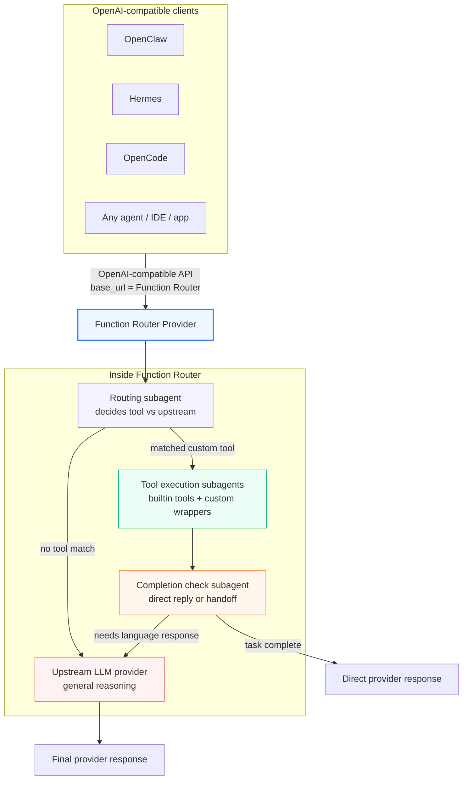

# OpenClaw Function Router

[English](README.en.md) | 简体中文

## 演示

https://github.com/user-attachments/assets/2ee2a195-fa7f-4be1-a14c-ecdc53bbc83a

> OpenAI-compatible Function Router Provider：通过自定义工具实现垂类加速，同时保留上游 LLM 的通用能力。

OpenClaw Function Router 是一个 OpenAI-compatible 的 **模型 Provider / Provider Proxy**。任何可以配置 OpenAI-compatible `base_url` 的客户端、Agent 框架、网关、IDE 或评测系统，都可以把本仓库作为可直接接入的 Provider endpoint 使用。



## 为什么选择 Function Router？

| 优势 | 说明 |
|---|---|
| 自定义工具 | 将系统控制、文件处理、业务 API、企业内部流程等垂直领域封装为工具。 |
| 垂类加速 | 命中工具的请求走 Function Router 快速路径，其余请求透明转发到上游 LLM。 |
| 速度提升 | 系统控制 benchmark 中 permissive 模式达到 **6.85x 加速**。 |
| 准确率保持 | strict 模式保持 **100.0% Pass@1**，同时仍有 **4.99x 加速**。 |
| 可插拔架构 | builtin tools、wrapper 脚本、路由模型、completion check、上游 LLM 都可独立替换或组合。 |
| OpenAI-compatible | 客户端只需要配置 `base_url`，不必重写调用方式。 |

当前仓库提供的 benchmark 是 **系统控制垂类** 示例，用来展示“为高频领域新增工具后”的速度与准确率收益；你可以按同样方式为自己的垂直领域添加工具。

## 工作方式

在单一 Provider 接口背后，Function Router 组合了多个专门的 subagent：本地路由模型负责判断是否需要调用工具，builtin 或用户自定义工具执行器负责执行动作，可选的 completion-check 步骤负责判断工具流程是否可以直接回答，上游 LLM Provider 则在需要时生成最终回复。

## Benchmark 结果

在 [50 个 OpenClaw 桌面控制任务](docs/benchmarks/openclaw-function-router-0308/tasks.csv) 上，每个任务重复 4 次，Function Router 提供两个运行点：permissive 模式追求最低延迟，达到 **6.85x 加速**；strict 模式保持 **100.0% Pass@1**，同时仍有 **4.99x 加速**。

这个 benchmark 聚焦在系统控制领域。我们为常见桌面/系统动作新增了 Function Router 工具，然后在这个被加速的领域上测试延迟和任务成功率。同时我们也测试了更通用的 benchmark，通用智能表现没有回退；Function Router 只拦截匹配到你配置工具的请求，其余请求会继续转发给上游模型 Provider。

| 模式 | 模型 | Pass@1 | 平均耗时 | 加速比 | 亮点 | 原始结果 |
|---|---|---:|---:|---:|---|---|
| OpenClaw + Doubao | `doubao-seed-2-0-pro-260215` | 99.0% | 37.97s | 1.00x | Baseline | [EXP1](docs/benchmarks/openclaw-function-router-0308/exp1-openclaw-doubao/) |
| + Function Router permissive | 上游：`doubao-seed-2-0-pro-260215`<br/>路由：`qwen3-30b-a3b-instruct-2507` (w/o thinking) | 95.5% | 5.54s | **6.85x** | 最快模式 | [EXP2](docs/benchmarks/openclaw-function-router-0308/exp2-openclaw-doubao-fr-permissive/) |
| + Function Router strict | 上游：`doubao-seed-2-0-pro-260215`<br/>路由：`qwen3-30b-a3b-instruct-2507` (w/o thinking) | **100.0%** | 7.61s | **4.99x** | 可靠性与速度平衡最佳 | [EXP3](docs/benchmarks/openclaw-function-router-0308/exp3-openclaw-doubao-fr-strict/) |

Benchmark 任务集和汇总报告位于 [`docs/benchmarks/openclaw-function-router-0308/`](docs/benchmarks/openclaw-function-router-0308/)。

(TODO) 开源可视化自动评测平台

## 快速开始

1. 克隆本仓库。
2. 安装包：

```bash
pip install .
```

3. 运行安装脚本：

```bash
./scripts/install.sh
```

安装脚本会要求你配置两个 LLM endpoint：

| 配置项 | 含义 | 示例 |
|--------|------|------|
| **Routing model base URL** | 任意 OpenAI-compatible endpoint，只要模型支持 tool calling。Function Router 只把最新用户消息发给它，用于判断是否调用工具。 | `https://api.example.com/v1` |
| **Routing model name** | 路由 endpoint 上的模型名，必须支持 tool calling；可以是 Qwen、GPT 或其他 OpenAI-compatible tool-calling 模型。 | `your-tool-calling-model` |
| **Routing model API key** | 路由 endpoint 的 API key。如果不需要鉴权可填 `any`；也可用 `${ROUTING_API_KEY}` 从环境变量读取。 | `${ROUTING_API_KEY}` |
| **Upstream base URL** | 主 LLM API endpoint。没有工具命中或工具执行后需要最终回复时，原始请求会转发到这里。 | `https://api.openai.com/v1` |
| **Upstream API key** | 上游 endpoint 的 API key。 | `sk-...` |
| **Upstream model name** | 用于最终回复的上游模型名。 | `gpt-4o` |
| **Tools base directory** | 作为 `FR_TOOLS_BASE_DIR` 暴露给 wrapper 脚本的根目录。 | `/home/mt/tools` |
| **OpenClaw config path** | 需要注册 `function_router` 和 session-bridge plugin 的 `openclaw.json` 路径。 | `~/.openclaw/openclaw.json` |

安装脚本还会复制示例工具脚本，安装 OpenClaw session-bridge plugin，并在 `openclaw.json` 中注册 `function_router` provider。

复制出来的脚本是系统控制 benchmark 领域的示例，不是每个部署都必须直接使用的工具。`find`、`ls`、`cat`、`grep`、`sleep` 等 builtin tools 可以直接使用。对于你自己的加速领域，请把这些示例当作模板：在 `functions.jsonl` 中定义函数，在 `scripts/` 下添加对应 wrapper 脚本，并通过 `FR_TOOLS_BASE_DIR` 指向你的真实工具。

4. 重启 router：

```bash
./scripts/restart.sh
```

5. 重启完整服务栈（Function Router + OpenClaw Gateway）：

```bash
./restart_all.sh
```

该脚本会按反向依赖顺序停止服务，再带健康检查地重新启动。详见 [完整服务栈重启](#完整服务栈重启)。

安装完成后，你可以随时新增或更新工具。编辑 `~/.function-router/functions.jsonl`，并添加匹配的 `~/.function-router/scripts/<tool_name>.sh` wrapper，然后运行 `./scripts/restart.sh` 重启 Function Router，新工具定义即可生效。

## 添加自己的垂类工具

如果你已经有一个现成的 script-backed skill，希望直接转换成 Function Router 可加载的工具配置，可以使用内置的 `skill-to-fc` skill。它会辅助生成 `functions.jsonl` 条目和匹配的 wrapper 脚本，并安装到 `~/.function-router`。安装和使用方式见 [skill-to-fc 使用指南](docs/skill-to-fc.md)。

Function Router 的核心使用方式是：把你需要加速或需要确定性执行的垂直领域封装成工具。安装完成后，你可以随时编辑 `~/.function-router/functions.jsonl` 并添加匹配的 wrapper 脚本，重启 Function Router 后即可生效。

### wrapper 脚本不一定要复杂

wrapper 只是 Function Router 调用本地能力的可执行入口：它从 `stdin` 读取 JSON arguments，在 `stdout` 输出 JSON，并用 exit code 表示成功或失败。它可以是几行 shell，也可以调用 `curl`、`systemctl`、Go/Rust/Node 二进制、Python 脚本或企业内部 CLI；**不需要为了接入 Function Router 再额外包一层 Python**。

最小约定：

- 函数名必须和脚本文件名一致：`my_tool` → `~/.function-router/scripts/my_tool.sh`
- 输入：`stdin` 中的一段 JSON
- 输出：`stdout` 中的一段 JSON
- 成功：exit code `0`
- 失败：非 0 exit code，并尽量输出 JSON 错误信息
- `FR_TOOLS_BASE_DIR` 可选：只有当脚本需要定位外部工具目录时才使用

### 例子 1：查天气（公共 API，几行 shell）

适合“今天天气怎么样”“明天需要带伞吗”这类高频查询。把天气查询做成工具后，模型不需要搜索网页，直接调用权威 API，速度更快、结果更稳定。

`functions.jsonl`:

```jsonl
{"name":"weather_lookup","description":"Query current weather for a city from a weather API.","parameters":{"type":"object","properties":{"city":{"type":"string","description":"City name, for example Beijing or Shanghai"}},"required":["city"]}}
```

`~/.function-router/scripts/weather_lookup.sh`:

```bash
#!/bin/bash
set -euo pipefail
INPUT=$(cat)
CITY=$(jq -r '.city // empty' <<<"$INPUT")
[ -z "$CITY" ] && echo '{"error":"missing city"}' && exit 1
curl -fsS "https://wttr.in/${CITY}?format=j1" | jq '{result:"ok", city:.nearest_area[0].areaName[0].value, current:.current_condition[0]}'
```

### 例子 2：查快递 / 订单状态（内部 API，更准）

适合“我的订单到哪了”“查一下快递状态”“这个工单处理到哪一步了”等业务查询。真正部署时把 URL 换成你的订单、物流、CRM 或工单系统 API。

`functions.jsonl`:

```jsonl
{"name":"shipment_status","description":"Query shipment or order delivery status from an internal API.","parameters":{"type":"object","properties":{"tracking_id":{"type":"string","description":"Tracking number or order id"}},"required":["tracking_id"]}}
```

`~/.function-router/scripts/shipment_status.sh`:

```bash
#!/bin/bash
set -euo pipefail
INPUT=$(cat)
TRACKING_ID=$(jq -r '.tracking_id // empty' <<<"$INPUT")
[ -z "$TRACKING_ID" ] && echo '{"error":"missing tracking_id"}' && exit 1
curl -fsS "http://127.0.0.1:8080/shipments/${TRACKING_ID}" | jq '{result:"ok", shipment:.}'
```

### 例子 3：查服务状态 / 重启服务（本地运维工具，必须快）

适合“API 服务还活着吗”“重启一下 worker”“看看数据库连接池状态”等运维场景。这里 wrapper 只做参数适配，真正逻辑交给 `systemctl` 或你的内部运维 CLI。

`functions.jsonl`:

```jsonl
{"name":"service_status","description":"Check local service status quickly.","parameters":{"type":"object","properties":{"service":{"type":"string","description":"System service name"}},"required":["service"]}}
```

`~/.function-router/scripts/service_status.sh`:

```bash
#!/bin/bash
set -euo pipefail
INPUT=$(cat)
SERVICE=$(jq -r '.service // empty' <<<"$INPUT")
[ -z "$SERVICE" ] && echo '{"error":"missing service"}' && exit 1
STATUS=$(systemctl is-active "$SERVICE" 2>/dev/null || true)
jq -n --arg service "$SERVICE" --arg status "$STATUS" '{result:"ok", service:$service, status:$status}'
```

### 什么时候需要 Python？

只有在你的垂类逻辑本来就是 Python、或者需要复杂解析/多步骤编排时，才建议 wrapper 调用 Python 脚本。比如图像理解、复杂文件格式处理、批量数据转换等。即便如此，wrapper 也只需要做一层薄适配：读取 JSON、调用真实工具、输出 JSON。

### Builtin Shell Tools

Function Router 内置了五个由 Python 实现的 shell tools，因此即使 `scripts_dir` 中没有对应脚本也可使用：

- `find`：搜索路径下的文件或目录，例如 `*.mp4`
- `ls`：列目录内容
- `cat`：读取文本文件
- `grep`：搜索文件或目录中的文本
- `sleep`：等待一小段时间

builtin schema 位于 package 文件 `function_router/function-builtin.jsonl`。启动时会同时加载：

- 你配置的用户 `functions_file`
- package 内置的 `function-builtin.jsonl`

这些 builtin 会自动合并到工具列表中。如果 `functions.jsonl` 定义了同名工具，用户定义优先，builtin 会被跳过。

通用文件系统检查可直接用 builtin tools；VLC 控制、壁纸修改、设备操作等领域动作仍建议使用 `functions.jsonl` + `scripts/*.sh`。

### 启用新工具

```bash
chmod +x ~/.function-router/scripts/my_tool.sh
./scripts/restart.sh
curl -s http://127.0.0.1:18790/health | jq .
```

`tools_loaded` 应该增加。更详细的测试步骤和部署 checklist 见 [docs/adding-tools.md](docs/adding-tools.md)。

## OpenClaw 集成说明

即使不 patch OpenClaw，Function Router 也可以作为普通 OpenAI-compatible provider 工作，但有一个重要限制：

- **没有 OpenClaw session-header patch 时**，Function Router 仍然可以路由工具并返回最终回复。
- 但 Function Router 无法可靠地区分 OpenClaw session，因此依赖稳定 session id 的功能会降级：
  - `fr_context_history`
  - `fr_context_preserve`
  - AutoOpenClaw `/v1/tool_history` 精确 session 匹配

### 推荐模式

#### 模式 A — Session Bridge Plugin（推荐，OpenClaw >= 2026.3.24）

如果你需要以下能力，推荐使用该模式：

- 路由模型按 session 保留多轮上下文
- 不同对话之间严格 session 隔离
- AutoOpenClaw 根据 `session_key` 精确匹配 Function Router tool history

该模式使用仓库内置的 `plugins/session-bridge/`。插件会注册 provider hook，在每次请求 Function Router 时自动注入 OpenClaw session ID 到 `x-openclaw-session-id` HTTP header，无需手动 patch OpenClaw。

如果你使用了 `scripts/install.sh`，插件已经被安装和注册，无需额外操作。

**方式 1 — 从 ClawHub 安装（推荐）**

插件已发布到 ClawHub，OpenClaw 用户一行命令即可安装：

```bash
openclaw plugins install clawhub:openclaw-session-bridge-plugin
```

OpenClaw 会自动校验 plugin 兼容性（`pluginApi >= 2026.3.24`）并加载，无需手动拷贝文件或编辑 `openclaw.json`。包页面：<https://clawhub.ai/packages/openclaw-session-bridge-plugin>

**方式 2 — 从仓库手动复制**

```bash
cp -r plugins/session-bridge ~/.openclaw/extensions/session-bridge
```

然后在 `~/.openclaw/openclaw.json` 中加入：

```json
{
  "plugins": {
    "allow": ["session-bridge"],
    "entries": {
      "session-bridge": { "enabled": true }
    }
  }
}
```

重启 OpenClaw Gateway：

```bash
openclaw gateway stop && openclaw gateway start
```

工作方式：

1. OpenClaw 在每个 agent subprocess 中加载 session-bridge plugin。
2. 插件注册 provider，`hookAliases: ["function_router"]`。
3. 每次请求 `function_router` provider 时：
   - `wrapStreamFn` 拦截 HTTP stream 调用，并从 `options.sessionId` 注入 `x-openclaw-session-id`。
   - `resolveTransportTurnState` 处理 WebSocket / Responses API 路径。
4. Function Router 通过 `derive_session_key()` 读取 header，并用于 session-scoped context。

Function Router session key 优先级：

1. Header `x-openclaw-session-key`
2. Header `x-openclaw-session-id`（由 plugin 注入）
3. Body 字段：`sessionKey` / `sessionId` / `conversationId` / `chatId`
4. 嵌套 metadata fallback
5. `"default"`

#### 模式 B — 手动 OpenClaw Patch（legacy）

如果无法安装插件（OpenClaw < 2026.3.24），可以手动 patch OpenClaw runtime，注入 `x-openclaw-session-key` header。详见 [docs/openclaw-session-header-patch.md](docs/openclaw-session-header-patch.md)。

#### 模式 C — 无 session 支持的兼容模式

仅在你不需要严格 session 行为时使用。

推荐配置：

- `fr_context_history.enabled = false`
- `fr_context_preserve.enabled = false`

在该模式下：

- Function Router 仍然可以正常路由工具。
- AutoOpenClaw 可以 fallback 到旧的 prefix-based `/v1/tool_history` 匹配方式。
- 当 prompt 重复时，history 归因可能不准确。

### 验证

1. 重启 Function Router 和 OpenClaw Gateway。
2. 通过 gateway 发送真实请求。
3. 查看 Function Router 日志：

```bash
tail -f /tmp/fr.log | grep session
```

插件生效时：

```text
header x-openclaw-session-key= x-openclaw-session-id=b9a63970-0685-... session_key=b9a63970-0685-...
```

未生效时：

```text
header x-openclaw-session-key= x-openclaw-session-id= session_key=default
```

也可以查询 tool history：

```bash
curl -s "http://127.0.0.1:18790/v1/tool_history?limit=5" | jq '.entries[] | {timestamp, session_key}'
```

如果 entries 显示真实 UUID，说明 session bridge 生效；如果显示 `default`，说明插件未加载或未匹配。

```text
function_router/   Python package 和 server 入口
plugins/           OpenClaw provider plugins
  session-bridge/  Session ID header 注入插件
examples/          示例配置、functions 和 stub scripts
scripts/           安装、卸载和重启脚本
tests/             离线 pytest 测试集
```

## 配置

完整配置参考见 [docs/config.md](docs/config.md)。

### Completion check mode

配置方式：

```json
{
  "fr_completion_check": {
    "enabled": true,
    "mode": "permissive"
  }
}
```

- `enabled` 默认 `true`
- `mode` 默认 `"permissive"`
- 有效值为 `"permissive"` 和 `"strict"`

模式行为：

- `permissive`：如果 Function Router 工具成功执行，并且流程已经推进到自然的用户交接点，例如等待用户选择、确认或补充信息，则 completion check 返回 `TASK_COMPLETE`，Function Router 可以直接短路回复。
- `strict`：只有请求完全完成时才返回 `TASK_COMPLETE`。如果还需要用户操作、确认或补充信息，则返回 `TASK_INCOMPLETE` 并交给上游 LLM。

## 调试与可观测性

### Debug logging

当你需要排查路由决策、工具调用、pending session context 以及上游 handoff 行为时，可以开启 transcript-style debug 日志：

```json
{
  "debug_logging": {
    "enabled": true
  }
}
```

Debug 日志写入 `~/.function-router/logs/router.debug.log`，单文件 10MB 自动轮转：

```bash
tail -f ~/.function-router/logs/router.debug.log
```

路由侧对话会以紧凑 transcript 格式记录：

```text
2026-05-18 14:20:31 ===== SESSION_KEY ======
2026-05-18 14:20:31 b9a63970-0685-4f6a-9a2f-example
2026-05-18 14:20:31 USER: 把系统音量调到50%
2026-05-18 14:20:31 TOOL: system_control({"category":"volume","action":"set","value":50})
2026-05-18 14:20:31 TOOL RESULT [system_control]: {"result":"ok","tool_output":"Volume set to 50%"}
2026-05-18 14:20:31 ASSISTANT: 已将系统音量调整到50%。
```

当 Function Router handoff 到上游 LLM 时，debug 日志只记录 FR 维护的 pending context、当前用户消息和上游 assistant 回复，而不是 dump 完整 upstream request：

```text
2026-05-18 14:20:35 *** START UPSTREAM ***
2026-05-18 14:20:35     PENDING_UPSTREAM_TURNS before: 1
2026-05-18 14:20:35     PENDING_UPSTREAM_TURNS injected: 1
2026-05-18 14:20:35     PENDING_UPSTREAM_TURNS after_clear: 0
2026-05-18 14:20:35     USER1: 把系统音量调到50%
2026-05-18 14:20:35     ASSISTANT1: 已将系统音量调整到50%。
2026-05-18 14:20:35     USER2: 现在音量是多少？
2026-05-18 14:20:35     ASSISTANT last: 当前系统音量是50%。
2026-05-18 14:20:35 *** FINISHED UPSTREAM ***
```

### Tool History API

Function Router 在内存中维护最近工具执行历史，方便调试和监控。

**Endpoint:** `GET /v1/tool_history`

**查询参数：**

| 参数 | 类型 | 默认值 | 说明 |
|------|------|--------|------|
| `since` | string | None | ISO 8601 时间戳；只返回该时间之后的 entries |
| `limit` | int | 50 | 最大返回条数，范围 1-200 |

**响应：**

```json
{
  "entries": [
    {
      "timestamp": "2026-04-13T12:34:56.789Z",
      "session_key": "agent:main:abc123",
      "function_name": "system_control",
      "tool_input": {"action": "set_volume", "value": 50},
      "tool_result": {"result": "ok", "status": "success"},
      "user_message": "帮我把音量调到50"
    }
  ]
}
```

示例：

```bash
curl -s "http://127.0.0.1:18790/v1/tool_history?limit=5" | jq .
curl -s "http://127.0.0.1:18790/v1/tool_history?since=2026-04-13T00:00:00Z" | jq .
```

## 参考

### 概览

- 路由模型只看到清洗后的用户文本，以及 Function Router 自己维护的会话上下文。
- 路由前会移除 OpenClaw 元数据，例如 `<relevant-memories>`、sender blocks 和时间戳前缀。
- builtin 工具和自定义 wrapper 脚本都是一等执行目标。
- 支持可配置轮数的多轮工具循环。
- 可选 completion check 用于决定 Function Router 是否可以直接回复，还是需要交给上游 LLM。
- Function Router 会把路由侧 session context 与交给上游 LLM 的 session-scoped context 分开维护。
- `config.json` 中的密钥可以使用 `${ENV_VAR}` 形式从环境变量替换。

### 详细架构

```text
OpenClaw Gateway / Any OpenAI-compatible caller
                        |
                        v
              +----------------------+
              | Function Router      |
              | normalize request    |
              | - latest user text   |
              | - strip metadata     |
              +----------+-----------+
                         |
                         v
              +----------------------+
              | Load FR session      |
              | context              |
              +----------+-----------+
                         |
                         v
              +----------------------+
              | Local router model   |
              | Matches an           |
              | FR-defined tool?     |
              +-----+-----------+----+
                    |           |
                No  |           | Yes
                    |           |
                    v           v
          +----------------+   +----------------------+
          | Upstream LLM   |   | Execute matched tool |
          | passthrough    |   +-----+-----------+----+
          +--------+-------+         |           |
                   |                 |           |
                   |          +------+--+   +---+------------------+
                   |          | Builtin |   | Custom tools /      |
                   |          | tools   |   | wrapper scripts     |
                   |          +----+----+   +---------------------+
                   |               |
                   |               v
                   |      +------------------------+
                   |      | Completion check       |
                   |      | task complete?         |
                   |      +-----------+------------+
                   |                  |
                   |          +-------+--------+
                   |          |                |
                   |      Yes |                | No
                   |          |                |
                   |          v                v
                   |  +----------------+   +----------------------+
                   |  | Save FR        |   | Load upstream        |
                   |  | session        |   | session context      |
                   |  | context        |   +----------+-----------+
                   |  +--------+-------+              |
                   |           |                      v
                   |           v             +----------------------+
                   |  +----------------+     | Reset FR session    |
                   |  | Direct reply   |     | context             |
                   |  | short-circuit  |     +----------+----------+
                   |  +----------------+                |
                   |                                    v
                   +----------------------------> +----------------+
                                                  | Upstream LLM   |
                                                  | with extracted |
                                                  | session ctx    |
                                                  +--------+-------+
                                                           |
                                                           v
                                                    Final response
```

### 前置要求

- Python 3.10+
- 一个正在运行的 OpenAI-compatible 模型 endpoint，并且该模型支持 tool calling，用于路由判断
- 一个上游 LLM API 或 OpenAI-compatible endpoint，用于生成最终回复
- `bash`，用于执行脚本
- `jq`，用于运行 `examples/scripts/` 中的示例 stub 脚本

### 脚本接口

- 输入：通过 `stdin` 传入 JSON arguments
- 输出：通过 `stdout` 输出 JSON
- 成功：exit code `0`
- 失败：非 0 exit code，并在 `stderr` 输出错误信息

router 会把 tool call 中的 `arguments` 字符串直接传给脚本。

### 安装脚本行为

`./scripts/install.sh` 会：

- 创建 `~/.function-router/`
- 复制示例 `config.json`、`functions.jsonl` 和 stub scripts
- 根据交互式回答 patch 复制后的 config
- 备份 `openclaw.json`
- 添加 `function_router` provider entry
- 将 `primary_model` 设置为 `function_router/function-router`

`./scripts/uninstall.sh` 会移除 provider entry，并根据上游配置恢复 `primary_model`。

### 完整服务栈重启

`restart_all.sh` 会按正确依赖顺序重启完整服务栈：

1. 清理 stale sessions：`openclaw sessions cleanup --enforce`
2. 按反向顺序停止服务：OpenClaw Gateway → Function Router
3. 按依赖顺序启动服务：Function Router → OpenClaw Gateway
4. 每启动一个服务后先做健康检查，再继续下一步

可通过环境变量配置：

| 变量 | 默认值 | 说明 |
|------|--------|------|
| `PYTHON` | `python3` | Python 解释器 |
| `FR_REPO` | `~/openclaw-function-router` | Function Router 仓库根目录 |

重启后的服务 endpoint：

| 服务 | URL |
|------|-----|
| Function Router | `http://127.0.0.1:18790/health` |
| OpenClaw Gateway | `ws://0.0.0.0:18789` |

日志会写入 `/tmp/function-router.log` 和 `/tmp/openclaw-gateway.log`。

## 运行测试

```bash
pytest tests/
```

测试集使用 mock，不需要真实 router 或上游服务。

## 故障排查

### 端口冲突

如果 router 启动失败，请确认 `listen_port` 没有被占用。可以修改 `~/.function-router/config.json` 中的端口，然后重新运行 `./scripts/restart.sh`。

### 模型名不匹配

如果请求在到达上游模型前失败，请确认路由模型配置（`routing.model`，旧配置中的 `qwen.model` 仍可兼容）和 `upstream.model` 与各自 endpoint 暴露的模型名完全一致。

### 所有请求都转发到上游

如果所有请求都绕过工具执行：

- 检查最新用户文本是否真的匹配你定义的函数。
- 确认 `functions.jsonl` 是合法 JSONL，并且启动时已加载。
- 验证路由模型支持 tool calling。
- 查看 `~/.function-router/logs/router.log` 中的路由失败或工具执行错误。

## License

MIT
